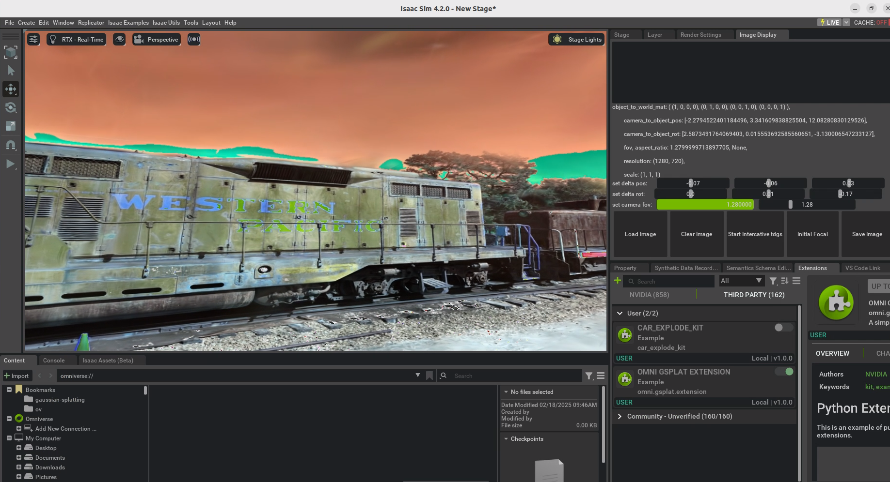
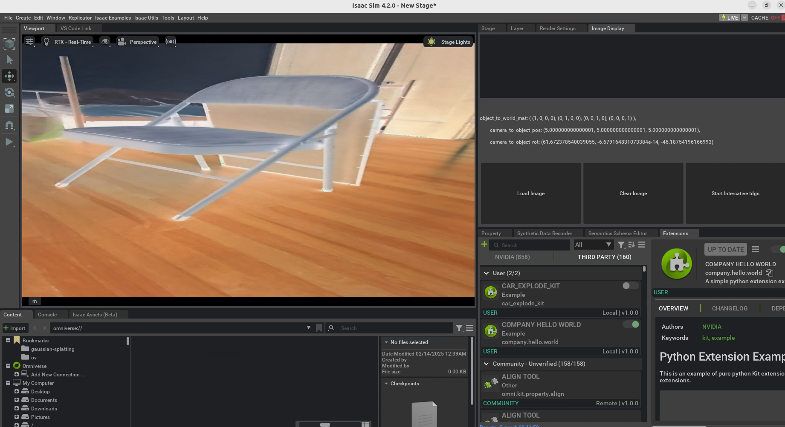
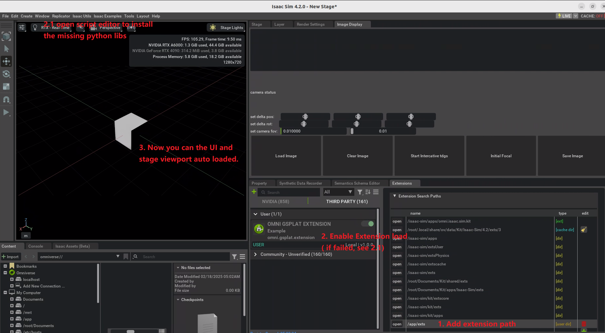
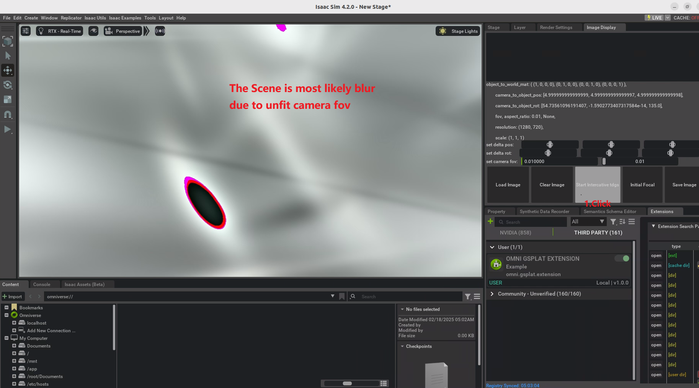
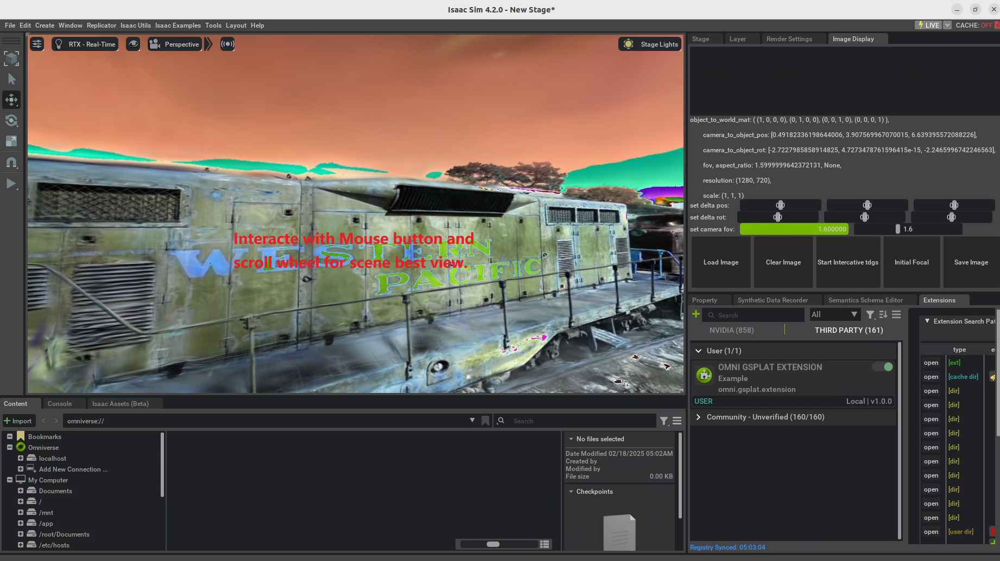

# Omni Gaussian Splatting


link: https://github.com/tangkangqi/omni-gassiansplating-extension


[video](<2025-02-18 02-15-45.mkv>)

[video](<2025-02-18 10-24-23.mkv>)


## High Point:
- Omniverse viewport realtime interactive by mouse, roll and sidebar
- Calculate prim Camera focal, rotation, position transformation for precise interactive control
- Vanilla Gaussian Splatting support (doesn't relay on nerfstudio or viser)
- Docker deployment support(updating...)
- Flask streaming compressed frame Microservice support (updating...)

## Improvement:
- Black screen flash issue when interactiving
- Load Ply to usd

# Acknowledgement and Play Around:
- [j3soon](https://github.com/j3soon) made this opensource nerf extension based on NerfStudio streaming and rpyc sync interactive, and the nerf scene is on a seperate UI with Omniverse Viewport only demo mesh assets and show rotation: https://github.com/j3soon/omni-nerf-extension
- [shumash](https://github.com/shumash) made a interactive piepline using NVIDIA Kaolin 14.0 and include camera parameters transform function with guidance: https://github.com/shumash/gaussian-splatting/blob/mshugrina/interactive/interactive.ipynb
- OpenUSD: https://openusd.org/release/tut_usd_tutorials.html
- Omniverse: https://docs.omniverse.nvidia.com/dev-guide/latest/programmer_ref/usd.html
- Viser: https://github.com/nerfstudio-project/viser
- NVIDIA Kaolin, Warp for volume rendering.

## STEPS:
1. Start isaacsim UI and add the extension.


2. Start gaussian splatting backend in the same workstation. 
- Note: you will need to install vanilla Gaussian Splatting, and the backend is compatible with 
[commit id: 414b5](https://github.com/graphdeco-inria/gaussian-splatting/tree/414b553ef1d3032ea634b7b7a1d121173f36592c)
```python
git clone https://github.com/graphdeco-inria/gaussian-splatting.git
git checkout 414b5
```
Then follow the steps to install Gaussian Splatting.
- Start gs_render service:
```python
pip install flask
cp exts\omni.gsplat.extension\omni\gsplat\extension\gs_render_api.py gaussisan-splatting
python gs_render_api.py
```

3. Visualize the gaussian result in Omniverse.
- Click "Start Interactive tgds" button to start visualize, first you might see a blur background, just adjust the focal side bar.



- Using mouse right button and roll wheel to realtime ajust, until you see a clear and interst region:
    - long press the right button for up/down/left/right rotate
    - scroll forward/backward for scalling up/down (note: currently not so precise as camera fov side bar)
    - long press the scroll for move the scene center


- You can fine tune the view parameters using UI side bar. 
    - Note the number in side bar are unlinear ratio to ajust the delat value
    - I use $y = \tan\left(\frac{\pi}{2.01} x\right)$ to function the side bar value from [-1, 1] to a large range $\tan\left(\frac{\pi}{2.01} \right)$ , and you can change 2.01 to 2.001 or 2.1 to get larger or smaller range.
- You can also click on "Save Image" to save this viewport scene. 
- You can click on hide "Clear Image" to see bare stage prim. 


========================================= 

This project was automatically generated.

- `app` - It is a folder link to the location of your *Omniverse Kit* based app.
- `exts` - It is a folder where you can add new extensions. It was automatically added to extension search path. (Extension Manager -> Gear Icon -> Extension Search Path).

Open this folder using Visual Studio Code. It will suggest you to install few extensions that will make python experience better.

Look for "company.hello.world" extension in extension manager and enable it. Try applying changes to any python files, it will hot-reload and you can observe results immediately.

Alternatively, you can launch your app from console with this folder added to search path and your extension enabled, e.g.:

```
> app\omni.code.bat --ext-folder exts --enable company.hello.world
```

# App Link Setup

If `app` folder link doesn't exist or broken it can be created again. For better developer experience it is recommended to create a folder link named `app` to the *Omniverse Kit* app installed from *Omniverse Launcher*. Convenience script to use is included.

Run:

```
> link_app.bat
```

If successful you should see `app` folder link in the root of this repo.

If multiple Omniverse apps is installed script will select recommended one. Or you can explicitly pass an app:

```
> link_app.bat --app create
```

You can also just pass a path to create link to:

```
> link_app.bat --path "C:/Users/bob/AppData/Local/ov/pkg/create-2021.3.4"
```


# Sharing Your Extensions

This folder is ready to be pushed to any git repository. Once pushed direct link to a git repository can be added to *Omniverse Kit* extension search paths.

Link might look like this: `git://github.com/[user]/[your_repo].git?branch=main&dir=exts`

Notice `exts` is repo subfolder with extensions. More information can be found in "Git URL as Extension Search Paths" section of developers manual.

To add a link to your *Omniverse Kit* based app go into: Extension Manager -> Gear Icon -> Extension Search Path

